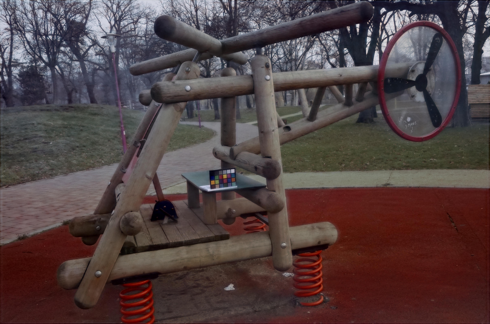

# Ultra-HD-image-dehazing
A novel network capable of real-time dehazing of 4K images on a single GPU, which consists of three deep CNNs.

The repository includes:
1. Source code of our model.
2. Training code for O-hazy dataset.
3. Testing code for O-hazy dataset

Setup:
Dependent libraries:
torch, numpy, tqdm, torchvision, kornia, opencv-python

Training:
Place the hazy training data set in the ./hazy folder and the corresponding clear data set in the ./gt folder.
Run the command python train.py.
The training process can be found under the ./result folder.
The model is saved in the ./model folder.

Test model:
Place the data set to be tested under the ./OHAZE_test file.
Run the command python test_model.py.
Test results can be found under the ./test_result folder.

Run cal_par.py to calculate PSNR value of the output image.
Run the command 
'''bash
python ssim.py --first 22_outdoor_gt.jpg --second test_result/22_outdoor_4.jpg
to calculate SSIM of the output image.

## Input Hazy image and Output Dehazed image:
<figure class="half">
    
    
</figure>

